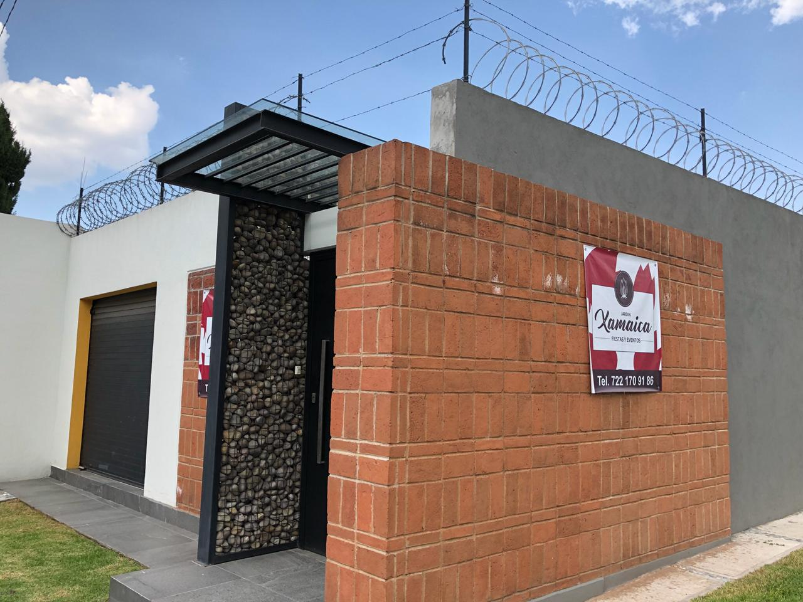
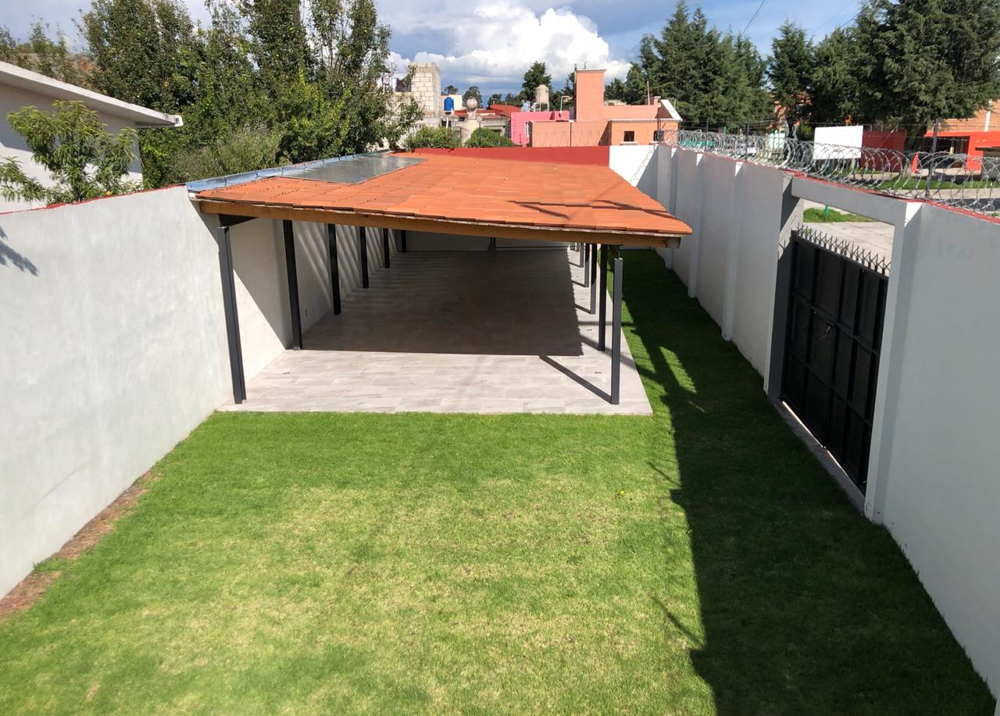
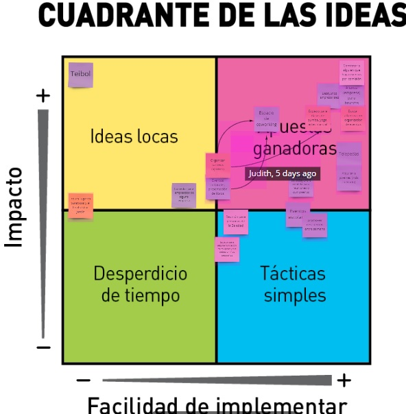
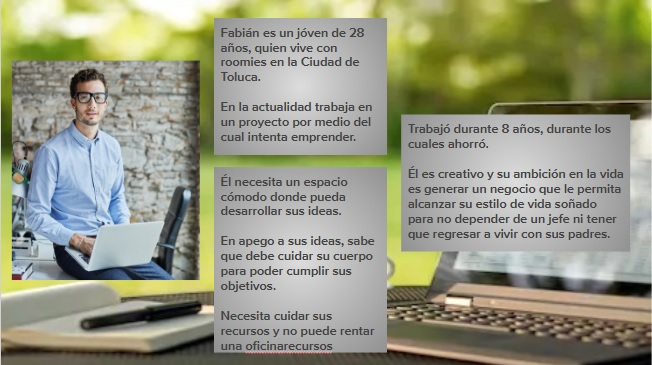
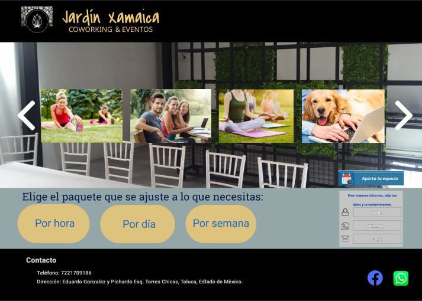

# RESUMEN DEL PROYECTO 

## OBJETIVOS DEL PROYECTO

El objetivo principal del proyecto es, a través de los procesos de investigación necesarios, determinar el problema actual del negocio para presentar la propuesta que se adecúe a los recursos con los que cuenta el cliente y que pueda ser resuelto de la forma más eficiente. 

Para dar inicio a este proyecto, se utilizó la metodología DESIGN THINKINGS a través de su etapa de EMPATIZAR, por lo que se acordó obtener información acerca del negocio y su contexto, por lo cual se decidió llevar a cabo una entrevista telefónica con la dueña del negocio. 
De igual forma, se llevó a cabo un proceso de Benchmark a través del cuál se ubicaron diferentes negocios enfocados a atender las mismas necesidades que JARDÍN XAMAICA, encontrando que a un radio de 8 kilómetros o menos, se encuentran ubicados el Salón Los Cisnes, Anturios Salón y Jardín, Adhara Eventos, Saalón de fiestas El Castillo, Salón y Jardín Kasino, Salón Los Ángeles, Salón VARGU, Finca San Benito, Mariano's Garden, Jardín Mallorca y Salón Bambú. 

La investigación también arrojó que muy cercano a esa zona y a un radio de 7 kilómetros o menos, se encuentran lugares de gran importancia cultural para la Ciudad de Toluca, como el Jardín Botánico, La Catedral de Toluca, Los Portales, Centro Cultural Mexiquense, Parque Metropolitano Bicentenario, Museo de Numismática, Museo de Antropología e Historia, Museo del Alfeñique, Reino del Chocolate Nestlé, entre muchos otros sitios de interés, lo cual nos indicó que JARDÍN XAMAICA, se encuentra ubicado en una zona de alta afluencia. 

En el siguiente [documento](https://docs.google.com/document/d/15OmE69bh6-r4cO4-7YFbiQUTeHxL8HoVOUrrONGYABU/edit) se encuentran las preguntas planteadas y la transcripción de los datos valiosos durante la llamada.

También nos fueron proporcionadas las siguientes imágenes del jardín, con lo que pudimos tener mayor información del lugar. 

**FACHADA**

**VISTA AÉREA**

## DEFINICIÓN

A través de la información obtenida de nuestro cliente, detectamos que su problema principal a resolver era una mayor generación de ingresos, de tal forma que el espacio fuera rentado no sólo los fines de semana, sino también de lunes a viernes. Sin embargo, al ser un negocio familiar y no ser su principal fuente de ingresos, el tiempo es limitado para poder atenderlo entre semana, bajo el mismo concepto como "jardín de eventos"

## IDEAR

Durante el proceso de ideación, utilizamos la herramienta CRAZY 8´s, a través de la cual pusimos sobre la mesa diversas propuestas para poder ocupar el espacio entre semana; posteriormente discutimos acerca de su viabilidad e impacto apoyándonos de la herramienta "cuadrante de las ideas" para finalmente definir la que consideramos, resolvería esta situación. 

**CUADRANTE DE LAS IDEAS**

Con base en la herramienta mencionada anteriormente, realizamos una combinación entre Coworking y ofertar diversas actividades físicas, lo cual coadyuvó para determinar la oferta de valor: *"Un coworking al aire libre para fomentar el cuidado de tu salud"*

## DEFINICIÓN DEL PÚBLICO OBJETIVO

Se define como nuestro público objetivo a jóvenes entre 22 y 33 años, que viven de forma independiente, son roomies o hijos de familia, pero con deseos de emprender, quienes necesitan un espacio colaborativo y con un alto grado de confort y tranquilidad para que puedan desarrollar tranquilamente sus ideas de trabajo. 

En su mayoría, son conscientes de que deben cuidar su estado de salud y buscan opciones de recreación. No pertenecen a la fuerza laboral "tradicional", por lo que pueden vestir comodamente e incluso, utilizar ese mismo atuendo para realizar actividades al aire libre. 

A continuación, anexamos el USER PERSONA que ejemplifica a nuestro usuario objetivo. 

Jardín Xamaica no limita su uso a jóvenes emprendedores, sino que tiene un espacio empastado el cual está propuesto para que cualquier persona que quiera realizar actividad física guiada por medio de un instructor, pueda acudir a fin de cuidar su salud, sin importar su edad, sexo u otras aficiones.

## DEFINICIÓN DE LA SOLUCIÓN PRODUCTO

Al descubrir durante la investigación que Jardín Xamaica se encuentra ubicado muy cercano a zonas de alta afluencia en la Ciudad de Toluca, determinamos que la opción de Coworking & Outdoor Activities es sumamente viable, por lo que nos dimos a la tarea de investigar si existen negocios bajo este concepto en esta ciudad. 

Encontramos que existen alrededor de 6 opciones que ofrecen espacios colaborativos cercanos a Jardín Xamaica:
- Vorticer Coworking (A 2.1 km de distancia)
- Network Coworking  (A 8.1 km de distancia)
- Luhmi Oficinas     (A 3.2 km de distancia)
- Proyecto 7         (A 2.8 km de distancia)
- Hub Metepec        (A 7.5 km de distancia)

Estos espacios operan bajo un esquema tradicional (espacio cerrado) y están enfocados a empresas de reciente creación, pero que cuentan con un presupuesto mayor, puesto que ofrecen paquetes que incluyen salas de juntas y/o lugares para invitados del emprendedor. 

Los paquetes principales manejan precios por hora, día, semana y por mes; generalmente incluyen junto con la estancia café, té y agua ilimitados, así como servicio de internet.

Se refuerza la viabilidad de este esquema, considerando que durante la entrevista la dueña nos indicó que tiene pensado invertir en mobiliario (mesas y sillas) para no tener que rentarlo siempre y no depender completamente de un proveedor, por lo que adquiriendo el equipo adecuado, este le puede servir para el Coworking y complementar los servicios que brinda durante el fin de semana. También se recomienda adquirir lockers para que los emprendedores puedan resguardar su equipo de cómputo y/o ropa, muebles tipo lounge que permitan la versatilidad para poder trabajar y disfrutar de un evento social, internet de alta velocidad el cual puede incluir tv de paga, la instalación de algún televisor y evaluar la adquisición de una barra para ofertar productos básicos (chocolate, café, bocadillos, galletas, etcétera) o probar con máquinas de vending que ofrezcan este tipo de productos. 

## LINK DE PROTOTIPO NAVEGABLE

Se anexa el link para acceso al prototipo en FIGMA 

**PROTOTIPO**

https://www.figma.com/file/Gtq5ndaab0McqgZpFUiDrP/Landing-Page-Jard%C3%ADn-Xamaica?node-id=0%3A1

## CUMPLIMIENTO DE OBJETIVOS DEL PROYECTO A TRAVÉS DE CONTENIDO

- La interfaz propuesta demuestra la PROPUESTA DE VALOR al hacer alusión a los beneficios que obtendrá el usuario final    si decide utilizar nuestras instalaciones. 
- Transmite al usuario final información puntual acerca de las diferentes opciones de cómo puede contratar el servicio     ofertado.
- Ofrece un botón de "call to action" para que el usuario final pueda reservar su acceso al Coworking de inmediato, así    como una agenda para verificar cuándo habrá disponibilidad sin tener que solicitar informes. Se sugiere que esta         opción esté vinculada a alguna solución de tipo CRM para tener un mejor control de las reservas e ingresos por ventas. 
- Se ofrece un formulario para que el usuario final pueda dejar sus datos si desea ser contactado. 
- Se visualiza el número telefónico para que aquellos usuarios que lo prefieran, puedan hacer contacto por este medio. 
- Se deja el link para las redes sociales a fin de que los usuarios puedan tener mayor información del negocio y/o hacer   contacto por este medio.

## RESOLVIENDO NECESIDADES DEL USUARIO FINAL A TRAVÉS DE CONTENIDO

- El usuario puede acceder a redes sociales para tener mayor información acerca del negocio, incluso opiniones de otros    usuarios. 
- Otorgamos diversas formas para hacer contacto con nosotros antes de realizar cualquier otra acción. 
- Tiene información oportuna acerca de los paquetes que se ofrecen. 
- Puede realizar directamente una reserva sin necesidad de tener contacto con el equipo del negocio. 

